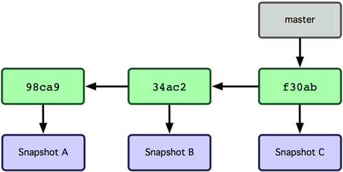

# Git for Scientists  

Presented by John McDonnell  
July 12, 2012

# Why use git?

1. Backups
1. Collaboration
1. Organization

# What is git? #

  * Git is a version control system. 

# What is git? #

  * It stores snapshots of your projects.
  * ...It also stores the relationships between those snapshots.

# Let's try.

    $ mkdir /tmp/myfirstrepo

    $ cd /tmp/myfirstrepo

    $ echo "This is my first file." > myfile.txt

    $ git init
    Initialized empty Git repository in /tmp/.git/

    $ ls .git # A look at what we've done.
    branches  config  description  HEAD  
    hooks     info    objects      refs

    $ git commit -am 'Initial commit.'
    master (root-commit) 5b4f9ff] Initial commit.
    1 file changed, 1 insertion(+)
    create mode 100644 myfile.txt

# File lifecycle.

1. Untracked
1. Tracked, unmodified
1. Tracked, modified
1. Staged

## Staging, illustrated.
    $ echo "This is my second file." > myfile2.txt
    
    $ git status # UNTRACKED
    On branch master
    # Untracked files:
    #   (use "git add <file>..." to include in what will be committed)
    #
    #       myfile2.txt
    nothing added to commit but untracked files present (use "git add" to track)
    
    $ git add myfile.txt
    
    $ git status  # STAGED
    On branch master
    # Changes to be committed:
    #   (use "git reset HEAD <file>..." to unstage)
    #
    #       new file:   myfile2.txt
    

## Staging, illustrated.
     
    $ echo "A change to this file." >> myfile2.txt # MODIFIED
    
    $ git status # STAGED *and* MODIFIED
    # On branch master
    # Changes to be committed:
    #   (use "git reset HEAD <file>..." to unstage)
    #
    #       new file:   myfile2.txt
    #
    # Changes not staged for commit:
    #   (use "git add <file>..." to update what will be committed)
    #   (use "git checkout -- <file>..." to discard changes in working directory)
    #
    #       modified:   myfile2.txt
     

## Staging, illustrated.

    $ git diff
    diff --git a/myfile2.txt b/myfile2.txt
    index d237c5c..be14d23 100644
    --- a/myfile2.txt
    +++ b/myfile2.txt
    @@ -1 +1,2 @@
     This is my second file
     +A change to my file.
    
    $ git diff --cached
    diff --git a/myfile2.txt b/myfile2.txt
    new file mode 100644
    index 0000000..d237c5c
    --- /dev/null
    +++ b/myfile2.txt
    @@ -0,0 +1 @@
    +This is my second file
    

## Staging, illustrated.

    $ git commit -m "Any guess what gets committed here?"
    [master 21e4239] Any guess what gets committed here?
     1 file changed, 1 insertion(+)
      create mode 100644 myfile2.txt
    
    $ git status
    On branch master
    # Changes not staged for commit:
    #   (use "git add <file>..." to update what will be committed)
    #   (use "git checkout -- <file>..." to discard changes in working directory)
    #
    #       modified:   myfile2.txt
    #
    no changes added to commit (use "git add" and/or "git commit -a")
    

## Undo!

    # Amending commits
    $ echo "Forgot this file!" > forgot.txt
    $ git add forgot.txt
    $ git commit --amend

    # Undoing uncommitted changes
    $ echo "Don't really need this line." > myfile.txt
    $ git add myfile.txt
    $ git reset HEAD myfile.txt  # Unstage
    $ git myfile.txt             # delete change.

# You just learned...

* ...how to add new files to the repository.
* ...how to stage and commit new changes.
* ...how to check the status of your current changes.
* ...how to undo changes to files and amend commts.

# Github / Remotes

# Remotes

    * Link your repo to the cloud.
    * Provide an interface for sharing with others.
    * Github provides free public repo hosting!

## Creating a github repo

    $ git remote add origin git@github.com:johnmcdonnell/demo.git
    $ git push -u origin master

## Cloning a github repo

    $ cd /tmp
    $ git clone git@github.com:johnmcdonnell/demo.git myclone
    Cloning into 'myclone'...
    remote: Counting objects: 9, done.
    remote: Compressing objects: 100% (4/4), done.
    Receiving objects: 100% (9/9), done.
    remote: Total 9 (delta 0), reused 9 (delta 0)

## Making changes and sending them back.

    $ cd /myclone
    $ echo "Changes to our file, in the clone." >> myfile.txt
    [master 1d5dd39] Changes in the clone.
     1 file changed, 1 insertion(+)

    $ git commit -a -m "Remote changes made."
    $ git push origin master
    Counting objects: 5, done.
    Delta compression using up to 4 threads.
    Compressing objects: 100% (3/3), done.
    Writing objects: 100% (3/3), 350 bytes, done.
    Total 3 (delta 0), reused 0 (delta 0)
    To git@github.com:johnmcdonnell/demo.git
       21e4239..1d5dd39  master -> master

## Getting our changes, with a twist.

    $ cd ../myrepo
    $ echo "Changes to our file, in our own repo." >> myfile.txt
    $ git commit -a -m "Local changes made."
    [master 672b384] Local changes made.
     1 file changed, 1 insertion(+)
    
    $ git pull origin master
    From github.com:johnmcdonnell/demo
     * branch            master     -> FETCH_HEAD
       Auto-merging myfile.txt
       CONFLICT (content): Merge conflict in myfile.txt
       Automatic merge failed; fix conflicts and then commit the result.
    
    $ $EDITOR myfile.txt # fix the conflict.
    
    $ git status
    # On branch master
    # Your branch is ahead of 'origin/master' by 2 commits.
    #
    nothing to commit (working directory clean)
    
    $ git commit
    $ git push origin master

# You just learned...

* ...how to create a new repository in github.
* ...how to clone remote repos and push changes to them.
* ...how to deal with merge conflicts.

# Branches

# What is a branch?

  * A branch is really just a seperate version of your code.
  * E.g., A 'pretty' version of your paper, vs. one you're overhauling.
  * In technical terms, it is a pointer to a commit.

# What is a commit, really?

# Repo as collection of commits

# A branch is a pointer to a commit.

# Two branches can point to the same commit.

`git branch testing`

# The files in our working directory reflect HEAD

HEAD points to master. Master points to the snapshot "f30ab".

# Move HEAD with checkout

`git checkout testing`

# New commits move the HEAD branch

`git commit...`

# A merge scenario

`git checkout master`  
`git commit...`

# A merge scenario

`git merge iss53`

# Making branches and tags

    $ git tag -a pilot -m "Our initial pilot experiment"
     
    $ git branch exp1
    $ git branch exp2
     
    $ git checkout exp1
    $ echo "Exp 1 makes manipulation A" >> myfile.txt
    $ git commit -a -m "Added manipulation A"
     
    $ git checkout exp2
    $ echo "Exp 2 makes manipulation B" >> myfile.txt
    $ git commit -a -m "Added manipulation B"

# Merging

    $ git checkout master
    $ $EDITOR myfile.txt  # Make an important bugfix
    $ git commit -a -m "Important bugfix"
    
    $ git checkout exp1
    $ git merge master
    
    $ git checkout exp2
    $ git merge master
    $ git diff master

# Using tags

    $git show pilot
    $git checkout pilot

     

# You just learned...

* What tags and branches are.
* How to make one.
* How to merge changes from one branch onto another branch.

# Conclusion

* Git helps keep every past and present version of your code safe.
* Git makes it easy to collaborate with others.
* Git's branching and tagging keep your code organized.
 

* Configuration
  * Turn on color  
        `git config --global color.ui "auto"`
  * Your signature  
        `git config --global user.name "Your Name"`  
        `git config --global user.email "your.email@nyu.edu"`
  * Your editor  
        `git config --global core.editor "mate -w"`  
  * Password caching for https  
        `git config --global credential.helper cache`

* Resources
  * ProGit book  
        [progit.org](http://progit.org)
  * Understanding git conceptually  
        [http://www.sbf5.com/~cduan/technical/git/](http://www.sbf5.com/~cduan/technical/git/)
  * Github help  
        [help.github.com](https://help.github.com/)
        
